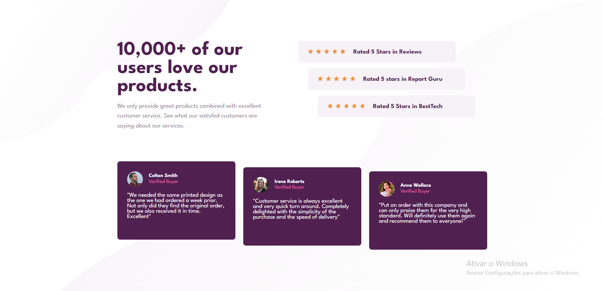
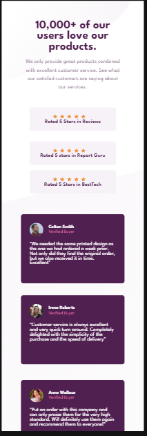

# Social Proof Section Master

Este é um site desenvolvido apartir do desafio Front-end Mentor

https://www.frontendmentor.io/challenges/social-proof-section-6e0qTv_bA

Este projeto foi feito para estudo próprio, com apredizagem das propriedades em CSS: FLEXBOX e GRID.

## Imagens do projeto

Desktop:

 
Mobile:

## Desafio que tive neste projeto:
O design do site, no começo foi um pouco desafiador, na parte da construção dos comentários, mas foi resolvido. A parte do responsivo também foi um pouco desafiador, pois algumas partes não estavam ficando conforme o design inicial. No fim o design asemlha ao que foi pedido.

## Tecnologias usadas:
- Html
- CSS

## Redes sociais:
- <a href="https://github.com/JhonpsDias" target="_blank"> Git Hub </a>

- <a href="https://www.linkedin.com/in/jo%C3%A3o-pedro-dias-castro-a795a0295/" target="_blank"> Linkedin</a>

Projeto feito por - <i>João Pedro Dias Castro</i>